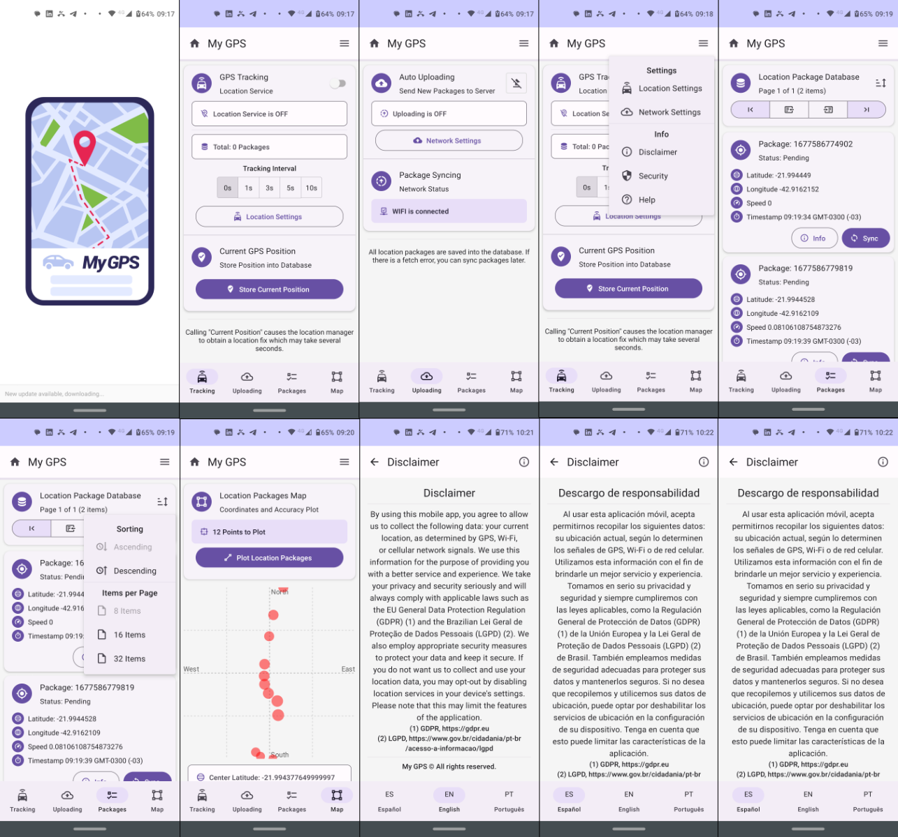

# My GPS React Native

Este projeto foi iniciado com `npx create-expo-app -t expo-template-blank-typescript .`

Abaixo você encontrará informações sobre como realizar tarefas comuns.

1. Baixe e instale o [Expo CLI](https://docs.expo.io/versions/latest/workflow/expo-cli/)
2. Abra seu terminal e navegue até o local desejado da sua máquina
3. Clone o projeto do GitHub usando o comando `git clone <url do repositório>`
4. Entre na pasta do projeto usando `cd <nome da pasta>`
5. Instale as dependências do projeto usando `npm install` ou `yarn install`
6. Rode o projeto usando `expo start` ou `yarn start`
7. Seu navegador web irá abrir exibindo o QRCode e o projeto em execução. Você também pode abrir o projeto no smartphone usando o app Expo.

## Desafio Contele React Native

Este projeto Expo React Native foi criado com o objetivo de facilitar o acesso ao banco de dados do servidor Contele hospedado em https://github.com/contele/contele-vagas/tree/master/react-native, que lida com serviços de geolocalização. O projeto Expo React Native permite que os usuários naveguem facilmente pelo banco de dados Contele de forma intuitiva. Esta aplicação foi projetada para ser simples de usar para todos os usuários, desde iniciantes até profissionais. Esta aplicação também foi criada para ser executada em diversos dispositivos móveis.

## Sumário
* [Tecnologias](#tecnologias)
* [Componentes Expo](#componentes-expo)
* [AsyncStorage](#asyncstorage)
* [Material Design](#material-design)
* [Idiomas](#idiomas)
* [Telas](#telas)
* [Agradecimentos](*#agradecimentos)

## Tecnologias

Para o desenvolvimento do projeto Expo React Native, foram usadas diversas tecnologias. O [NVM (Node Version Manager)](https://github.com/nvm-sh/nvm) foi usado para manter várias versões do Node.js e permitir que o desenvolvedor escolha a versão correta para o projeto. O [React Native](https://reactnative.dev/docs/getting-started) é um framework que permite o desenvolvimento de aplicativos para dispositivos móveis usando JavaScript e React. O [Expo](https://docs.expo.io/) foi usado como uma plataforma para criar, desenvolver e implantar aplicativos nativos para Android e iOS. O [Redux Toolkit](https://redux-toolkit.js.org/) foi usado para ajudar a manter um estado consistente e desacoplado. O [React Navigation](https://reactnavigation.org/docs/) foi usado para gerenciar as navegações entre as telas do aplicativo. O [TypeScript](https://www.typescriptlang.org/docs/home.html) foi usado para melhorar a tipagem das variáveis e melhorar o desenvolvimento do projeto. Por fim, o [Axios](https://github.com/axios/axios) foi usado para gerenciar as solicitações de API. Com essas tecnologias, foi possível criar um projeto Expo React Native de forma rápida, segura e com ótimos resultados.

## Componentes Expo

No projeto React Native usamos alguns componentes do Expo, como o [Location](https://docs.expo.io/versions/latest/sdk/location/), o [AsyncStorage](https://docs.expo.io/versions/latest/sdk/async-storage/) e o [Battery](https://docs.expo.io/versions/latest/sdk/battery/). Apesar de também termos considerado adicionar o [LocalAuthentication](https://docs.expo.io/versions/latest/sdk/local-authentication/) e o [BarCodeScanner](https://docs.expo.io/versions/latest/sdk/bar-code-scanner/), optamos por não implementá-los devido ao escopo deste projeto.
O Location permite buscar a localização do usuário, como a latitude e longitude atuais. O AsyncStorage é uma solução que nos ajuda a salvar dados de forma assíncrona no dispositivo, enquanto o Battery fornece informações sobre o nível de bateria do dispositivo. No entanto, o LocalAuthentication nos permitiria usar biometria, como reconhecimento por impressão digital, para autenticação e proteção dos dados, enquanto o BarCodeScanner poderia nos ajudar a ler códigos de barras dentro do aplicativo, a exemplo de links de autenticação da API. Embora esses dois últimos componentes possam ser extremamente úteis, optamos por não adicioná-los ao projeto devido ao escopo limitado deste projeto.

## AsyncStorage

Realizou-se uma série de testes com a API AsyncStorage para garantir uma experiência fluida. O AsyncStorage é uma API de armazenamento de dados assíncrona e é uma das APIs mais úteis para projetos React Native. Ele é usado para armazenar dados que não precisam ser mantidos entre sessões, como preferências de usuário, configurações, escolhas de usuário, etc. Durante os testes, todos os dados foram armazenados e recuperados corretamente, o que garantiu que o aplicativo funcionasse corretamente e oferecesse uma experiência fluida ao usuário. Além disso, todas as funcionalidades do aplicativo foram testadas para verificar se estavam funcionando corretamente e, se necessário, foram ajustadas de acordo. Ao final dos testes, foi possível concluir que a API AsyncStorage foi bem-sucedida em fornecer aos usuários uma experiência fluida e livre de problemas.

## Material Design

Para implementar o projeto, foi utilizada uma série de Cross-platform Material Design para React Native ([React Native Paper](https://callstack.github.io/react-native-paper/) e [Material Design Icons](https://materialdesignicons.com/)), que segue a [Licença Apache 2.0](http://www.apache.org/licenses/LICENSE-2.0), o que significa que pode ser usada para fins pessoais e comerciais. Estes recursos oferecem suporte ao desenvolvimento de aplicativos nativos e web para dispositivos iOS, Android e Windows, além de fornecer um conjunto de componentes e estilos padrão para o desenvolvimento de aplicativos. React Native Paper oferece uma variedade de componentes de design de materiais, como botões, caixas de seleção, campos de texto, ícones e outros. Além disso, o Material Design Icons possui uma ampla biblioteca de ícones para uso em aplicativos React Native. Com esses recursos, é possível criar aplicativos modernos que seguem os padrões de design da plataforma para fornecer uma experiência de usuário consistente e intuitiva. Estas ferramentas são úteis para qualquer desenvolvedor que deseja desenvolver aplicativos React Native com a menor quantidade de tempo possível.

## Idiomas

Para implementar um projeto Expo React Native, a informação foi inicialmente escrita em inglês, e então será traduzida para o português brasileiro e espanhol (MercoSul). Pelo fato de nos preocuparmos com nossos usuários, pelo menos o "Disclaimer" (Aviso Legal) foi escrito em inglês, português e espanhol.

## Telas

Neste projeto React Native, implementamos uma estrutura de navegação para facilitar a experiência do usuário. A partir da tela inicial (Home), o usuário tem acesso a quatro opções principais: "Network (Rede)" (para configurar a API), "Location (Localização)" (para configurar a localização por GPS), "Packages (Pacotes)" (para acessar a base de dados de pacotes) e "Disclaimer (Aviso Legal)" (para informar o usuário sobre o uso de seus dados). Ao selecionar uma das opções, o usuário será direcionado à próxima tela, onde poderá realizar as configurações ou confirmar o uso de seus dados. Esta estrutura de navegação foi projetada para tornar a experiência do usuário mais fácil e intuitiva.

## Agradecimentos

Obrigado por ler a documentação! Sou Bráulio Silveira, meu perfil no LinkedIn é https://www.linkedin.com/in/bosilveira/ e sou um desenvolvedor full stack.